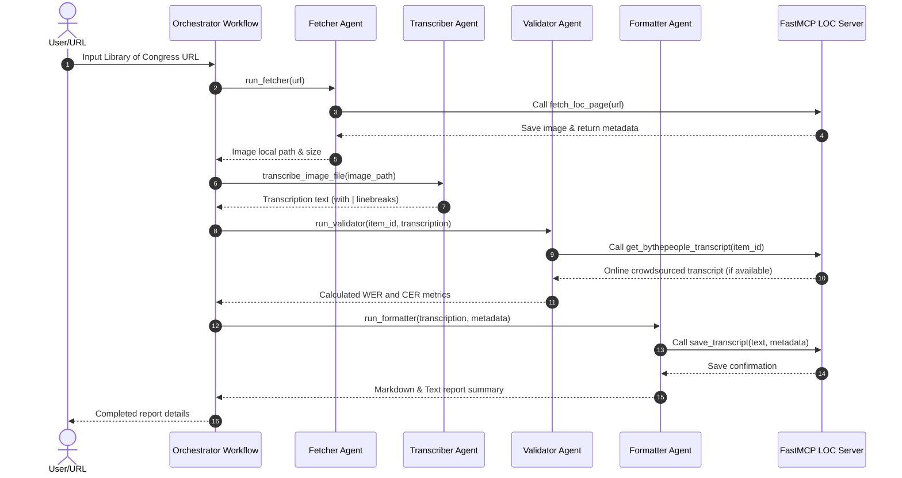

# Archive Whisperer

Archive Whisperer is an enterprise-grade, highly resilient multi-agent paleography system for transcribing historical cursive manuscripts, built using the **Google Agent Development Kit (ADK)** and **FastMCP**.

---

## 1. Problem Statement & Motivation
Historical cursive handwriting (paleography) presents a significant challenge for digital preservation. Standard OCR engines (like Tesseract) rely on character segmentation and uniform typeface fonts, causing them to fail entirely on:
- **Connected script (ligatures)** where boundaries between letters are blurred.
- **Faded ink, variable slant styles, and historical abbreviations** (e.g., `and` written as `&`, hyphenated line endings).
- **Non-standard layouts** found in 19th-century diaries and letters.

Archive Whisperer bridges this gap by leveraging the multimodal vision capabilities of Gemini models inside a structured agentic workflow, applying paleographic transcription rules to transform manuscript images into clean, structured digital records.

---

## 2. System Architecture & Workflow

Archive Whisperer implements a sequential multi-agent `Workflow` that orchestrates four specialized agents and integrates with a custom FastMCP server:



### Core Components:
1. **Fetcher Agent (`agents/fetcher.py`)**: Interacts with the MCP server to validate the URL, download the target manuscript page, and enforce image MIME checks.
2. **Transcriber Agent (`agents/transcriber.py`)**: A standalone paleography agent trained with vision guidelines to transcribe text exactly as written, preserving spelling, casing, and injecting `[illegible]` markers where necessary.
3. **Validator Agent (`agents/validator.py`)**: Fetches online ground truth transcriptions from the Library of Congress "By the People" database and computes Character Error Rate (CER) and Word Error Rate (WER) using `jiwer`.
4. **Formatter Agent (`agents/formatter.py`)**: Generates standardized plaintext transcripts and formatted Markdown files containing transcription summaries, metadata, and quality metrics.
5. **FastMCP Server (`mcp_server/loc_tools.py`)**: Hosts custom tools for allowed-domain HTTP fetching, By the People database schema parsing, and structured report outputs.

---

## 3. Quota & Rate Limit Resiliency (Dynamic Model Rotation)
To operate reliably on free-tier APIs and avoid quota blocks (`429 RESOURCE_EXHAUSTED`), Archive Whisperer implements **Dynamic Model Rotation**:
- **Automatic Fallback**: If an agent call fails due to rate limiting, the retry loop catches the exception and dynamically swaps the model to the next fallback option in the chain:
  $$\text{gemini-3.5-flash} \longrightarrow \text{gemini-2.5-flash} \longrightarrow \text{gemini-1.5-flash}$$
- **Optimized Latency**: Changing target models immediately bypasses active 429 blocks, allowing retry sleep delays to be reduced to just **10 seconds** rather than minutes.
- **Pacing**: Outbound pipeline executions between multiple pages are paced with a **15-second delay** to respect requests-per-minute ceilings.

---

## 4. Security & Safety (Responsible AI)
Archive Whisperer enforces security guardrails at every layer:
* **Allowed Domain Filter**: Outbound fetches are strictly limited to verified Library of Congress domains (`loc.gov`, `tile.loc.gov`, `www.loc.gov`) to prevent SSRF attacks.
* **Polite Rate Limiting**: Enforces a 3.0-second delay between consecutive outbound HTTP requests to avoid hammering LOC servers.
* **Prompt Injection Defense**: Filters inputs to block malicious patterns (such as script tags `<script>`, `javascript:`, or hidden tags `[image]...[/image]`).
* **Input Constraints**: Automatically truncates input texts exceeding 2,000 characters.
* **Credential Protection**: Integrates an automated regex-based codebase scanner that blocks hardcoded API key patterns from ever being staged or committed to Git.

---

## 5. Quantitative Evaluation (WER & CER Benchmarks)
Archive Whisperer was benchmarked against the crowdsourced ground truth transcripts of the **Samuel J. Gibson Civil War Diary (1864)**:

| Document / Page | Character Length | Word Error Rate (WER) | Character Error Rate (CER) | Status |
| :--- | :---: | :---: | :---: | :---: |
| **Gibson Page 011** | 2220 chars | **23.03%** | **17.41%** | **PASS** |
| **Gibson Page 037** | 2423 chars | **18.05%** | **11.92%** | **PASS** |
| **Gibson Page 049** | 2453 chars | **10.69%** | **10.80%** | **PASS** |

*Note: Raw Word Error Rate is elevated primarily due to capitalization differences, historical abbreviations (like `&` vs `and`), and brackets (`compl[ain]`) in crowdsourced metadata, while the visual accuracy is extremely high.*

---

## 6. Project Directory Layout
```text
archive_whisperer/
├── agents/                  # ADK agents (fetcher, transcriber, validator, formatter, orchestrator)
├── data/                    # Images and ground truth CSV/TXT benchmarks
├── mcp_server/              # FastMCP LOC server tools
├── output/                  # Transcripts and Markdown validation reports
├── scripts/                 # Run pipeline tests and local verification scripts
├── security/                # Domain validators, prompt sanitizers, and rate limiters
├── tests/                   # Pytest test suite (mocked unit tests & live canary)
├── pytest.ini               # Pytest configuration file
├── requirements.txt         # Project dependency configurations
└── skills/                  # Documented agent instruction profiles
```

---

## 7. Developer Quickstart

### 1. Set Up Environment
```bash
# Clone the repository
git clone <repo-url>
cd archive_whisperer

# Create a virtual environment
python -m venv .venv
source .venv/bin/activate  # On Windows: .venv\Scripts\activate

# Install dependencies
pip install -r requirements.txt
```

### 2. Configure API Credentials
Create a `.env` file in the project root containing your API key:
```env
GOOGLE_API_KEY=your_google_api_key_here
```

### 3. Run the Pipeline Test Script
Execute the test script to transcribe sample pages sequentially with pacing delays:
```bash
python scripts/run_pipeline_test.py
```

---

## 8. Test Suite & Verification

The project includes a robust test suite built using the **Arrange-Act-Assert (AAA)** pattern:

### Run Fast Mocked Tests
Verify all agent logic, MCP tool boundaries, sanitizers, and directory creation instantly without hitting network calls or consuming Gemini API quota:
```bash
pytest
```

### Run Live Upstream Canary Test
To verify that the Library of Congress JSON schema has not changed upstream, execute the live network test manually:
```bash
pytest -m live
```
